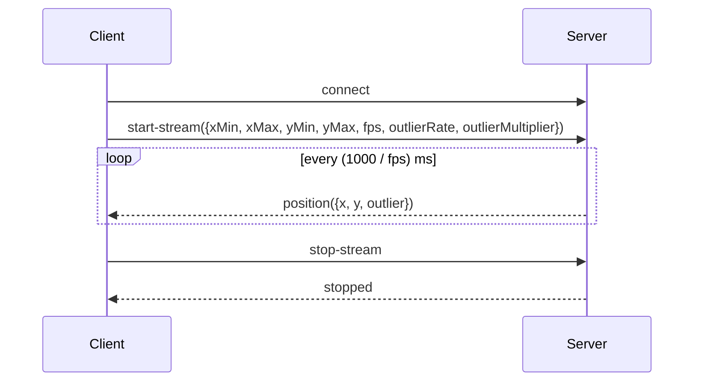

# 📡 TransGuardFakeGateway - WebSocket API

NestJS 기반 WebSocket 서버로, 좌표 데이터를 FPS 주기에 맞춰 스트리밍하며, 일정 확률로 "튐(outlier)" 값을 포함할 수 있습니다.

---

## 🔌 연결 정보

- **URL**: `ws://localhost:3000`
- **프로토콜**: Socket.IO
- **Namespace**: `/` (기본)
- **CORS**: 허용됨 (`origin: '*'`)

---

## 🧩 지원 이벤트 목록

| 이벤트명       | 방향            | 설명                            | 페이로드 예시                                                     |
| -------------- | --------------- | ------------------------------- | ----------------------------------------------------------------- |
| `connect`      | Server → Client | 클라이언트 연결 성공            | 없음                                                              |
| `disconnect`   | Server → Client | 클라이언트 연결 해제            | 없음                                                              |
| `start-stream` | Client → Server | 좌표 스트리밍 시작 요청         | `{ xMin, xMax, yMin, yMax, fps, outlierRate, outlierMultiplier }` |
| `position`     | Server → Client | 주기적으로 전달되는 좌표 데이터 | `{ x: 37.2, y: 88.1, outlier: false }`                            |
| `stop-stream`  | Client → Server | 좌표 스트리밍 종료 요청         | 없음                                                              |
| `stopped`      | Server → Client | 서버가 스트리밍 종료 알림       | 없음                                                              |

---

## 🧪 Payload 상세 설명

### 🔹 `start-stream`

| 필드                | 타입   | 설명                                    |
| ------------------- | ------ | --------------------------------------- |
| `xMin`              | number | x 최소값                                |
| `xMax`              | number | x 최대값                                |
| `yMin`              | number | y 최소값                                |
| `yMax`              | number | y 최대값                                |
| `fps`               | number | 초당 좌표 전송 횟수 (1초 = 1000ms 기준) |
| `outlierRate`       | number | 튐(outlier) 발생 확률 (%)               |
| `outlierMultiplier` | number | 튐 발생 시 범위의 몇 배로 벗어날지 결정 |

---

## 🔁 데이터 흐름 예시

